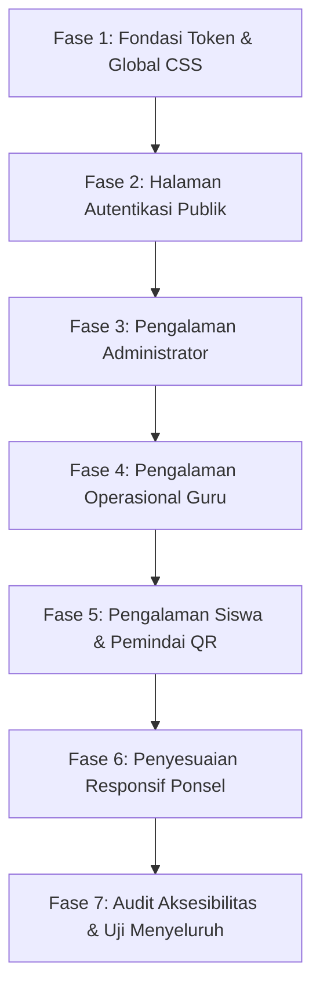

# Sistem Desain dan Panduan UI/UX Presensi SMAN 2 Cimalaka

Dokumen ini adalah acuan tunggal (single source of truth) untuk antarmuka pengguna (UI) dan pengalaman pengguna (UX) aplikasi Presensi SMAN 2 Cimalaka. Seluruh pembaruan visual, komponen antarmuka, dan tata letak halaman harus mengikuti pedoman dalam dokumen ini tanpa membuat variasi gaya tersendiri.

---

## A. Prinsip Desain

1. **Bersih dan Fungsional**: Antarmuka dirancang untuk efisiensi kerja harian di sekolah negeri. Tata letak memprioritaskan keterbacaan data kehadiran dan kemudahan pengoperasian, bukan efek grafis dekoratif.
2. **Kerapatan Informasi yang Tepat**: Guru dan administrator mengelola puluhan kelas dan ratusan siswa. Antarmuka harus menyajikan data secara terstruktur dan ringkas (high data density) tanpa ruang kosong berlebihan.
3. **Identitas Resmi Sekolah**: Identitas visual resmi SMA Negeri 2 Cimalaka mengacu pada warna Putih dan Biru Muda sesuai lambang sekolah. Warna hijau tidak digunakan sebagai warna merek utama.
4. **Dapat Diprediksi**: Elemen yang memiliki fungsi serupa harus memiliki bentuk, posisi, interaksi, dan bahasa visual yang seragam di seluruh halaman.
5. **Aman dan Jelas untuk Ponsel**: Pemindaian QR oleh siswa dan pencatatan kehadiran oleh guru sering dilakukan melalui ponsel cerdas. Target sentuh (touch target), kontras teks, dan aliran tombol dirancang khusus untuk kenyamanan perangkat bergerak.

---

## B. Warna Merek dan Token Warna

### 1. Palet Identitas Sekolah (Putih + Biru Muda)
Warna merek utama SMAN 2 Cimalaka berakar pada warna dasar putih bersih dan aksen biru muda cerah, dipadukan dengan biru pekat untuk teks dan tombol agar memenuhi standar kontras keterbacaan WCAG AA (rasio kontras minimal 4.5:1 terhadap putih).

| Token CSS | Kode Hex | Peruntukan |
| :--- | :--- | :--- |
| `--color-surface` | `#ffffff` | Latar kartu, modal, tabel, dan bidang input utama. |
| `--color-bg` | `#f8fafc` | Latar belakang kanvas aplikasi (slate sangat muda). |
| `--color-bg-subtle` | `#f1f5f9` | Latar komponen sekunder, badge netral, dan baris tabel bergantian. |
| `--color-primary-light` | `#e0f2fe` | Aksen biru muda lembut untuk latar status aktif, sorotan baris, dan hover halus. |
| `--color-primary` | `#0284c7` | Aksen biru muda cerah untuk ikon merek, indikator fokus, dan tautan aktif. |
| `--color-primary-dark` | `#0369a1` | Biru tua untuk tombol utama, teks judul penting, dan header tabel. Kontras tinggi terhadap putih. |
| `--color-primary-deep` | `#0f172a` | Slate gelap untuk navigasi utama dan teks tajuk tingkat satu. |

### 2. Warna Teks dan Netral
| Token CSS | Kode Hex | Peruntukan |
| :--- | :--- | :--- |
| `--color-text-main` | `#0f172a` | Teks utama, judul, nilai data penting. Rasio kontras 15.8:1 terhadap putih. |
| `--color-text-muted` | `#475569` | Teks pendukung, label formulir, metadata, keterangan tanggal. |
| `--color-text-subtle` | `#64748b` | Placeholder input dan teks bantuan sekunder. |
| `--color-border` | `#cbd5e1` | Garis batas kartu, tabel, dan pembatas navigasi. |
| `--color-border-subtle` | `#e2e8f0` | Garis pembatas baris data tabel dan divider internal. |

### 3. Warna Semantik Fungsional
Warna fungsional hanya digunakan untuk menyampaikan makna status data. Warna hijau dibatasi secara ketat hanya untuk status sukses atau hadir.

| Status | Teks / Garis | Latar Belakang | Makna Fungsional |
| :--- | :--- | :--- | :--- |
| **Sukses / Hadir** | `#166534` | `#f0fdf4` | Kehadiran tepat waktu, konfirmasi tersimpan, akun aktif. |
| **Peringatan / Terlambat** | `#854d0e` | `#fefce8` | Kehadiran terlambat, token mendekati kedaluwarsa. |
| **Bahaya / Alfa / Error** | `#991b1b` | `#fef2f2` | Alfa, pembatalan akun, pesan kesalahan validasi. |
| **Izin / Dispensasi** | `#075985` | `#f0f9ff` | Keterangan izin dinas, dispensasi kegiatan resmi. |
| **Sakit** | `#6b21a8` | `#faf5ff` | Keterangan sakit siswa dengan surat/pemberitahuan. |
| **Netral / Belum** | `#475569` | `#f1f5f9` | Siswa belum ditandai, data draf, informasi umum. |

### 4. Aturan Penerapan Warna
- **Larang**: Menggunakan warna hijau sebagai latar navigasi sidebar, tombol aksi utama, atau latar kartu umum.
- **Larang**: Membuat gradasi warna warni pada tombol atau kartu aplikasi.
- **Wajib**: Pastikan seluruh teks di atas latar berwarna memiliki rasio kontras minimal 4.5:1 terhadap latar belakangnya.

---

## C. Tipografi

Sistem tipografi menggunakan jenis huruf tanpa kait (sans-serif) sistem modern untuk memastikan kecepatan muat nol milidetik dan keterbacaan tajam pada semua sistem operasi (Windows, Android, iOS, macOS, Linux).

### 1. Susunan Keluarga Huruf (Font Stack)
```css
font-family: -apple-system, BlinkMacSystemFont, "Segoe UI", Roboto, Helvetica, Arial, sans-serif;
```

### 2. Skala Hirarki Tipografi
| Tingkat | Ukuran | Berat Huruf | Jarak Baris | Contoh Penggunaan |
| :--- | :--- | :--- | :--- | :--- |
| **Judul Halaman (H1)** | `1.75rem` (28px) | 700 (Bold) | 1.2 | Judul utama tiap halaman di header. |
| **Judul Bagian (H2)** | `1.25rem` (20px) | 600 (Semibold) | 1.3 | Judul kartu, sub-bagian formulir, judul tabel. |
| **Judul Modul (H3)** | `1.05rem` (17px) | 600 (Semibold) | 1.35 | Nama siswa pada kartu pindaian, judul modal dialog. |
| **Teks Utama (Body)** | `0.9375rem` (15px) | 400 (Regular) | 1.5 | Isi paragraf umum, penjelasan alur, bantuan. |
| **Data Tabel** | `0.875rem` (14px) | 400 & 500 | 1.4 | Isi sel tabel kehadiran dan daftar siswa. |
| **Label Formulir** | `0.875rem` (14px) | 600 (Semibold) | 1.3 | Label input teks, dropdown, radio, dan checkbox. |
| **Teks Bantuan / Catatan** | `0.8125rem` (13px) | 400 (Regular) | 1.4 | Helper text di bawah input, cap waktu, keterangan NIS. |
| **Teks Angka Ringkasan** | `1.5rem` - `2rem` | 700 (Bold) | 1.1 | Metrik angka total kehadiran, jumlah siswa aktif. |
| **Eyebrow / Kategori** | `0.75rem` (12px) | 700 (Bold) | 1.2 | Label kecil kapital di atas H1 (`letter-spacing: 0.05em`). |

---

## D. Sistem Spasi (Spacing)

Sistem spasi mengadopsi kelipatan 4px / 8px yang teratur untuk mencegah nilai acak.

| Token | Nilai Piksel | Penggunaan Khusus |
| :--- | :--- | :--- |
| `space-1` | 4px | Jarak internal elemen kecil, spasi ikon terhadap teks. |
| `space-2` | 8px | Jarak antar item daftar kecil, gap tombol aksi sejajar. |
| `space-3` | 12px | Padding vertikal tombol standar, padding sel tabel rapat. |
| `space-4` | 16px | Padding sel tabel umum, padding input formulir, gap elemen form. |
| `space-6` | 24px | Padding internal kartu, jarak antar bagian data. |
| `space-8` | 32px | Jarak antar modul utama halaman, padding kontainer utama desktop. |
| `space-12` | 48px | Batas vertikal halaman autentikasi. |

---

## E. Tata Letak dan Kontainer (Layout)

### 1. Struktur Rangka Aplikasi (Shell)
- **Desktop (>= 1024px)**:
  - Tata letak dua kolom tetap: Sidebar navigasi kiri (`260px`) dan area konten utama kanan (`minmax(0, 1fr)`).
  - Sidebar menggunakan posisi tetap (sticky) dengan latar putih bersih atau biru tua netral, dengan garis pemisah vertikal abu-abu tipis (`1px solid #e2e8f0`).
  - Lebar maksimum konten utama: `1200px`, rata tengah dengan margin seimbang.
- **Tablet (768px - 1023px)**:
  - Sidebar menyusut menjadi versi ringkas atau bilah samping lipat.
  - Padding area konten: `20px`.
- **Ponsel (< 768px)**:
  - Struktur kolom tunggal.
  - Navigasi atas ringkas (top bar) dengan logo sekolah, judul ringkas, dan tombol menu drawer.
  - Padding area konten: `16px`.

### 2. Pembatas Lebar Konten
- Halaman autentikasi (`/login`, `/activate`, `/change-password`): Lebar kontainer dibatasi maksimal `440px` rata tengah vertikal dan horizontal.
- Halaman operasional dan tabel (`/admin/students`, `/attendance/history`, `/teacher`): Lebar kontainer penuh mengikuti kontainer utama (`max-width: 1200px`).

---

## F. Tombol dan Elemen Aksi (Buttons)

Tombol harus memiliki hierarki visual yang jelas agar pengguna tidak keliru memilih aksi utama dan aksi pembatalan.

### 1. Ragam Tombol
1. **Tombol Utama (Primary)**:
   - Latar belakang: `--color-primary-dark` (`#0369a1`).
   - Warna teks: Putih murni (`#ffffff`).
   - Status Hover: `#0284c7`.
   - Status Aktif: `#075985`.
   - Penggunaan: Simpan data, Masuk, Generate Kode, Mulai Kamera, Unduh Laporan.
2. **Tombol Sekunder (Secondary)**:
   - Latar belakang: `--color-bg-subtle` (`#f1f5f9`).
   - Garis batas: `1px solid #cbd5e1`.
   - Warna teks: `#0f172a`.
   - Status Hover: Latar `#e2e8f0`.
   - Penggunaan: Filter, Kembali, Batal non-kritis, Cetak Ulang.
3. **Tombol Bahaya / Destruktif (Danger)**:
   - Latar belakang: `#dc2626`.
   - Warna teks: Putih murni (`#ffffff`).
   - Status Hover: `#b91c1c`.
   - Penggunaan: Nonaktifkan Akun, Reset Kode Aktivasi Masal, Hapus Data.
4. **Tombol Teks (Ghost / Quiet)**:
   - Latar belakang: Transparan.
   - Warna teks: `#475569`.
   - Status Hover: Latar `#f1f5f9`, teks `#0f172a`.
   - Penggunaan: Tautan keluar (Logout) pada bilah samping, aksi batal ringan.

### 2. Spesifikasi Fisik Tombol
- **Tinggi Standar**: `42px` (desktop), `46px` (ponsel untuk sentuhan jari).
- **Tinggi Tombol Rapat (Small)**: `34px` (khusus tabel baris data).
- **Radius Sudut (Border Radius)**: `8px` (konsisten di seluruh aplikasi, bukan pil bulat penuh).
- **Status Fokus (Focus-Visible)**: Cincin luar `2px solid #0284c7` dengan offset `2px`.
- **Status Nonaktif (Disabled)**: Opasitas `0.45`, kursor tidak diizinkan (`not-allowed`), tidak ada reaksi hover.

---

## G. Formulir dan Input Data

### 1. Spesifikasi Bidang Input
- **Tinggi Input**: `42px` (input teks, tanggal, jam, seleksi).
- **Latar Belakang**: Putih murni (`#ffffff`).
- **Garis Batas**: `1px solid #cbd5e1`, radius sudut `8px`.
- **Status Fokus**: Garis batas berubah menjadi `#0284c7` disertai bayangan cincin fokus lembut `0 0 0 3px rgba(2, 132, 199, 0.15)`.
- **Status Galat**: Garis batas `#dc2626`, teks bantuan galat di bawah input dengan warna `#991b1b`.

### 2. Label dan Bantuan
- Label selalu diletakkan di atas input dengan teks tegas (`font-weight: 600`, ukuran `0.875rem`).
- Setiap input wajib memiliki atribut `id` dan terhubung dengan label melalui atribut `htmlFor`.
- Hindari menyembunyikan label hanya demi estetika minimalis.
- Teks bantuan (helper text) ditempatkan tepat di bawah bidang input dengan warna abu-abu netral (`#64748b`).

---

## H. Kartu dan Kontainer Informasi (Cards)

### 1. Aturan Anti-Penumpukan Kartu (Anti-Card-Soup)
Kartu hanya boleh digunakan jika memenuhi salah satu kriteria berikut:
- Mengelompokkan formulir yang berdiri sendiri (misalnya form login, form tambah guru).
- Memisahkan panel kontrol utama dari panel visual (misalnya kontrol QR di sebelah gambar QR).
- Menampilkan panel filter data di atas tabel data.

**Larangan Keras Penggunaan Kartu**:
- **Dilarang**: Membungkus setiap baris siswa dalam kartu terpisah pada halaman guru atau riwayat. Gunakan baris tabel data.
- **Dilarang**: Membuat kartu bersarang di dalam kartu lain (nested cards).
- **Dilarang**: Mengisi halaman dengan kisi kartu kosong hanya untuk mengisi ruang layar (seperti kartu informasi statis di dasbor).

### 2. Spesifikasi Kartu Standar
- Latar belakang: `#ffffff`.
- Garis batas: `1px solid #e2e8f0`.
- Sudut lengkung: `10px` (proporsional dan rapi).
- Bayangan (Box Shadow): Sangat halus `0 1px 3px rgba(15, 23, 42, 0.06)`, bukan bayangan pekat menyebar.

---

## I. Tabel Data dan Rekapitulasi

Tabel adalah komponen inti untuk presensi dan manajemen data siswa. Kerapatan dan keterbacaan data adalah prioritas utama.

### 1. Standar Tampilan Tabel
- **Header Tabel (`<th>`)**: Latar belakang abu-abu sejuk (`#f8fafc`), teks abu-abu gelap (`#475569`), kapitalisasi huruf awal kata (Title Case atau Upper-case kecil), teks rata kiri kecuali kolom angka atau aksi, padding `10px 14px`.
- **Baris Data (`<td>`)**: Padding vertikal `10px 14px`, garis pembatas bawah `1px solid #e2e8f0`. Teks rata kiri, angka rata kanan atau tengah.
- **Hover Baris**: Latar berubah menjadi `#f8fafc` saat kursor berada di atas baris.
- **Kolom Aksi**: Tombol aksi dikelompokkan rapat dengan ukuran kecil (`button-small`), hindari menanam formulir ekspansi masif langsung di dalam sel tabel.
- **Responsivitas Ponsel**: Tabel dibungkus dalam kontainer geser horizontal (`overflow-x: auto`) yang rapi, atau diubah menjadi tampilan daftar ringkas satu baris terstruktur untuk layar sangat sempit.

---

## J. Lencana Status (Badges)

Status harus dapat dibedakan melalui teks yang jelas dan tidak mengandalkan warna semata.

### 1. Ragam Lencana Presensi
- **Tepat Waktu**: Teks "Tepat Waktu", latar `#f0fdf4`, teks `#166534`, ikon titik hijau.
- **Terlambat**: Teks "Terlambat", latar `#fefce8`, teks `#854d0e`, ikon titik kuning.
- **Sakit**: Teks "Sakit", latar `#faf5ff`, teks `#6b21a8`, ikon titik ungu.
- **Izin**: Teks "Izin", latar `#f0f9ff`, teks `#075985`, ikon titik biru.
- **Alfa**: Teks "Alfa", latar `#fef2f2`, teks `#991b1b`, ikon titik merah.
- **Dispensasi**: Teks "Dispensasi", latar `#f0fdfa`, teks `#115e59`, ikon titik toska.
- **Belum Ditandai**: Teks "Belum Hadir", latar `#f1f5f9`, teks `#475569`, ikon titik abu-abu.

### 2. Ragam Lencana Akun
- **Aktif**: Teks "Aktif", latar `#f0fdf4`, teks `#166534`.
- **Nonaktif**: Teks "Nonaktif", latar `#fef2f2`, teks `#991b1b`.
- **Teraktivasi**: Teks "Sudah Aktivasi", latar `#f0fdf4`, teks `#166534`.
- **Kode Siap**: Teks "Kode Tersedia", latar `#e0f2fe`, teks `#0369a1`.
- **Belum Ada Kode**: Teks "Perlu Kode", latar `#fefce8`, teks `#854d0e`.

---

## K. Navigasi dan Bilah Samping (Sidebar)

### 1. Struktur Navigasi Desktop
- **Header Bilah Samping**: Logo SMAN 2 Cimalaka berwarna asli dengan teks nama sekolah "SMAN 2 Cimalaka" dan sub-judul "Sistem Presensi".
- **Daftar Navigasi**: Tautan navigasi berupa daftar vertikal dengan ikon pendukung yang bermakna dan label teks yang ringkas.
- **Indikator Aktif**: Tautan halaman yang sedang dibuka mendapatkan latar belakang biru muda lembut (`#e0f2fe`), teks biru pekat (`#0369a1`, `font-weight: 600`), dan garis aksen vertikal kiri tebal 3px berwarna `#0284c7`.
- **Footer Akun**: Terletak di dasar sidebar dengan garis pemisah tipis, memuat nama pengguna aktif, NIS/ID, lencana peran pengguna, dan tombol "Keluar".

### 2. Struktur Navigasi Ponsel
- Navigasi tidak boleh menempati area vertikal konten secara permanen di ponsel.
- Gunakan bilah atas (topbar) dengan tinggi `56px` yang memuat tombol menu hamburger di sebelah kiri dan logo sekolah di sebelah kanan.
- Menu bilah samping muncul sebagai panel geser (slide-over drawer) saat tombol menu ditekan, dan tertutup saat tautan dipilih atau latar belakang redup diklik.

---

## L. Modal dan Dialog Konfirmasi

### 1. Spesifikasi Dialog
- **Lebar Maksimum**: `480px` untuk konfirmasi atau formulir sederhana, `640px` untuk formulir multi-langkah.
- **Latar Belakang Redup (Backdrop)**: `rgba(15, 23, 42, 0.45)` dengan efek pengaburan latar belakang lembut (`backdrop-filter: blur(2px)`).
- **Tata Letak Tombol Aksi**: Tombol pembatalan di sebelah kiri, tombol konfirmasi aksi utama di sebelah kanan.
- **Aksi Destruktif**: Tombol konfirmasi harus berwarna merah (`--color-danger`), dan isi dialog wajib merinci konsekuensi aksi secara spesifik (misalnya: "Siswa ini tidak akan dapat masuk ke sistem presensi sampai diaktifkan kembali").

---

## M. Alur Antarmuka Presensi QR

### 1. Layar Tampilan QR (Guru dan Admin)
- Panel kontrol sesi menyajikan status sesi yang jelas: Apakah sesi sedang aktif atau berhenti.
- Saat aktif, tampilkan hitung mundur waktu rotasi QR (siklus 5 menit) dan cap waktu rotasi berikutnya secara akurat.
- Gambar QR disajikan pada kontainer berlatar putih bersih dengan kontras maksimal agar mudah dipindai oleh kamera ponsel dari jarak beberapa meter di dalam kelas atau gerbang sekolah.
- Sediakan tombol pintas "Cetak Layar QR" untuk kebutuhan tempel darurat.

### 2. Pemindai Kamera Siswa (`/student/scan`)
- **Status Akses Kamera**:
  - Sebelum kamera aktif: Tampilkan tombol jelas "Mulai Kamera" dengan instruksi singkat.
  - Saat meminta izin: Tampilkan status "Menyiapkan kamera...".
  - Saat aktif: Tampilkan bingkai bidik (viewfinder) persegi dengan panduan sudut bidik yang jelas dan halus.
  - Jika izin ditolak atau perangkat tidak mendukung: Berikan pesan ramah yang memandu siswa untuk menggunakan aplikasi kamera bawaan ponsel lalu membuka tautan yang terdeteksi.
- **Umpan Balik Hasil Pindai**:
  - Hasil sukses: Tampilkan panel hijau lembut berisi status kehadiran ("Hadir Tepat Waktu" atau "Terlambat"), cap jam presensi yang dicatat server, dan tombol kembali ke beranda siswa.
  - Hasil galat: Tampilkan panel merah lembut dengan penjelasan yang dapat dipahami siswa (misalnya: "QR sudah kedaluwarsa. Silakan pindai QR terbaru di layar guru.").

---

## N. Status Pemuatan Data (Loading States)

- **Aksi Tombol**: Saat tombol memproses data (misalnya saat login atau simpan), ubah teks tombol menjadi kata kerja berproses dengan akhiran titik tiga (misalnya "Menyimpan...", "Memproses...") dan nonaktifkan tombol untuk mencegah klik ganda.
- **Tabel Data**: Gunakan baris kerangka abu-abu netral (skeleton rows) dengan animasi kedip sangat halus untuk mengisi ruang baris saat memuat data, bukan meletakkan spinner besar di tengah layar yang menyebabkan lonjakan tata letak.
- **Kamera Pindai**: Tampilkan teks status transisi yang jelas di dalam area bidik.

---

## O. Status Data Kosong (Empty States)

Status kosong harus informatif dan memberikan panduan langkah berikutnya.
- **Daftar Siswa Kosong**: "Belum ada data siswa untuk kelas ini. Periksa kembali filter kelas atau impor daftar siswa melalui menu Impor Siswa."
- **Riwayat Presensi Kosong**: "Tidak ditemukan data presensi pada rentang tanggal yang dipilih. Ubah tanggal mulai dan tanggal akhir untuk melihat data lainnya."
- **Slip Aktivasi Kosong**: "Semua siswa pada kelas ini sudah memiliki kode aktivasi aktif atau sudah teraktivasi."

---

## P. Penanganan Galat dan Umpan Balik (Feedback)

- **Pemberitahuan Singkat (Alerts)**:
  - Kotak peringatan diletakkan tepat di atas konten yang relevan dengan padding `12px 16px`, radius sudut `8px`, dan garis tepi tipis.
  - Pesan galat harus menyatakan apa yang terjadi dan bagaimana memperbaikinya.
  - Contoh baik: "ID siswa atau kata sandi tidak sesuai. Pastikan penulisan huruf besar dan angka sudah benar."
  - Contoh buruk: "Error 500: Terjadi kesalahan sistem."
- **Pemberitahuan Sukses**:
  - Konfirmasi visual atas aksi yang berhasil disimpan harus otomatis hilang atau dapat ditutup dengan jelas.

---

## Q. Desain Responsif (Responsive Breakpoints)

Sistem menggunakan tiga breakpoint standar:
1. **Desktop**: `>= 1024px`
   - Konten lebar, sidebar navigasi tetap di sebelah kiri, tabel data menyajikan seluruh kolom informasi.
2. **Tablet**: `768px - 1023px`
   - Sidebar navigasi dapat ditutup atau ringkas, tabel menggunakan scroll horizontal terisolasi.
3. **Ponsel**: `< 768px` (dan ponsel sempit `< 480px`)
   - Header aplikasi dengan menu toggle, form ditata satu kolom vertikal, tombol aksi utama berukuran penuh (full-width), target klik minimal 44x44px.

---

## R. Aksesibilitas (Accessibility Standards)

1. **Kontras Warna**: Seluruh teks judul dan teks isi harus lulus uji kontras rasio minimal 4.5:1 terhadap latarnya sesuai WCAG AA.
2. **Navigasi Papan Ketik (Keyboard Navigation)**: Setiap tombol, tautan, dan bidang input dapat diakses melalui tombol Tab, dengan cincin fokus yang tampak tegas (`focus-visible`).
3. **Deskripsi Elemen Interaktif**: Setiap tombol berbentuk ikon wajib menyertakan atribut `aria-label` atau teks tersembunyi (`.sr-only`).
4. **Kemandirian Warna**: Status tidak boleh dikomunikasikan melalui warna saja. Teks penjelas (misalnya "Hadir", "Alfa", "Aktif") wajib selalu disertakan bersama lencana warna.

---

## S. Inventaris Komponen Dapat Digunakan Kembali (Component Reuse)

Untuk menghindari duplikasi kode antarmuka dan inkonsistensi visual, komponen-komponen berikut harus distandarisasi dan digunakan ulang:
1. `SchoolLogo`: Komponen logo resmi dengan varian warna dan ukuran yang proporsional.
2. `StatusBadge`: Lencana status untuk kehadiran (`on_time`, `late`, `sick`, dll.) dan akun (`active`, `inactive`).
3. `DataTable`: Komponen pembungkus tabel data lengkap dengan header seragam, baris data, dan overflow horizontal.
4. `Pagination`: Navigasi halaman tabel dengan nomor halaman, tombol sebelumnya, dan tombol berikutnya.
5. `ConfirmDialog`: Dialog modal konfirmasi untuk aksi sensitif dan destruktif.
6. `PageHeader`: Header atas halaman yang konsisten dengan eyebrow, judul H1, deskripsi, dan tombol aksi halaman.
7. `AlertBox`: Komponen peringatan banner untuk galat, peringatan, dan sukses.
8. `FormField`: Pembungkus input formulir dengan label terhubung, teks bantuan, dan pesan validasi galat.

---

## Panduan Anti-AI-Slop (Anti-AI-Slop Guardrails)

Aturan ketat untuk mencegah antarmuka terlihat seperti templat SaaS generik buatan AI:
1. **Dilarang Menumpuk Kartu**: Jangan membungkus setiap elemen atau teks ke dalam kotak kartu. Halaman administrasi dan kehadiran harus berupa lembar kerja data yang bersih.
2. **Dilarang Menggunakan Gradasi Dekoratif Tanpa Alasan**: Hindari gradasi warna latar belakang ungu-biru, efek bayangan menyala (glow), atau latar belakang berkilau.
3. **Dilarang Sudut Membulat Berlebihan (Pill Overuse)**: Jangan membuat semua tombol, kartu, dan formulir berbentuk lonjong kapsul (pill shape). Gunakan radius sudut konsisten 8px hingga 10px.
4. **Dilarang Kartu Statistik Kosong**: Jangan menambahkan widget kartu statistik di dasbor kecuali kartu tersebut memuat angka metrik riil dari database.
5. **Dilarang Mengorbankan Kerapatan Informasi**: Jangan memberikan jarak margin atau padding raksasa (misalnya `py-16` di dalam tabel) yang memaksa guru melakukan scroll panjang hanya untuk melihat 10 nama siswa.
6. **Dilarang Animasi yang Berlebihan**: Hindari efek animasi memantul, melayang, atau transisi halaman lambat yang menghambat kecepatan kerja guru saat mencatat kehadiran di kelas.
7. **Dilarang Mencampur Bahasa**: Seluruh label antarmuka, pesan validasi, dan tombol aksi harus seragam menggunakan Bahasa Indonesia yang baku dan komunikatif.

---

## Audit UI/UX Saat Ini (Current UI Audit)

Audit mendalam terhadap kondisi repositori saat ini menghasilkan temuan-temuan spesifik yang dikelompokkan berdasarkan tingkat kepentingannya:

### 1. Temuan Kritis (P0 — Critical Usability and Safety)

#### Temuan P0-1: Aksi Penonaktifan Akun Tanpa Dialog Konfirmasi
- **Halaman**: `app/(protected)/admin/teachers/page.tsx` (baris 125-131) dan `app/(protected)/admin/students/page.tsx` (baris 110-116).
- **Masalah Saat Ini**: Tombol "Nonaktifkan" langsung mengirimkan form POST ke server action saat diklik tanpa konfirmasi pengguna.
- **Dampak Masalah**: Administrator yang tidak sengaja menyentuh tombol di layar sentuh ponsel akan langsung mengunci akun guru atau siswa bersangkutan dan memutus sesi aktif mereka seketika.
- **Rekomendasi Solusi**: Pasang dialog konfirmasi modal (`ConfirmDialog`) sebelum server action dijalankan.

#### Temuan P0-2: Kelas CSS Tombol Bahaya dan Peringatan Tidak Didefinisikan di Global CSS
- **Halaman**: `app/(protected)/admin/students/activation-bulk/bulk-activation-control.tsx` (baris 60 dan 66).
- **Masalah Saat Ini**: Tombol konfirmasi reset slip menggunakan `className="button button-danger"` dan pembungkus konfirmasi menggunakan `className="alert alert-warning"`. Kedua kelas CSS ini (`.button-danger` dan `.alert-warning`) tidak didefinisikan sama sekali di `app/globals.css`.
- **Dampak Masalah**: Tombol destruktif yang menghanguskan seluruh kode aktivasi siswa satu kelas atau satu sekolah tampil sebagai tombol abu-abu biasa tanpa penanda visual bahaya merah, dan kotak peringatan tidak memiliki warna penanda.
- **Rekomendasi Solusi**: Tambahkan definisi kelas `.button-danger` dan `.alert-warning` ke dalam token global CSS.

#### Temuan P0-3: Tabel Daftar Siswa Merender 670+ Baris Sekaligus Tanpa Paginasi
- **Halaman**: `app/(protected)/admin/students/page.tsx` (baris 86-160).
- **Masalah Saat Ini**: Seluruh siswa sekolah (676 siswa) dirender sekaligus ke dalam satu tabel HTML panjang, lengkap dengan form ekspansi ubah kata sandi di setiap barisnya.
- **Dampak Masalah**: Beban DOM sangat berat (ribuan node DOM), menyebabkan kelambatan gulir (scroll lag) dan browser ponsel berpotensi macet atau hang saat membuka halaman kelola siswa.
- **Rekomendasi Solusi**: Terapkan paginasi server (25 atau 50 siswa per halaman) dan pindahkan formulir reset kata sandi dari sel tabel ke dalam dialog modal terpisah.

---

### 2. Temuan Penting (P1 — Important UI/UX Improvement)

#### Temuan P1-1: Pelanggaran Warna Identitas Resmi Sekolah (Dominasi Warna Hijau)
- **Halaman**: `app/globals.css`, sidebar navigasi, tombol, header, kartu status, dan laporan PDF.
- **Masalah Saat Ini**: Variabel `--primary` disetel ke warna hijau hutan (`#126b51`), latar sidebar berwarna hijau gelap (`#113d31`), latar kartu aktif hijau muda (`#eef6f3`), dan header PDF presensi menggunakan warna hijau. Identitas resmi sekolah SMAN 2 Cimalaka adalah Putih dan Biru Muda.
- **Dampak Masalah**: Menghilangkan identitas sekolah yang sebenarnya dan menimbulkan kerancuan makna dengan warna status sukses.
- **Rekomendasi Solusi**: Terapkan sistem warna Putih dan Biru Muda sesuai spesifikasi Bagian B. Hijau dialihkan murni untuk status kehadiran Hadir / Sukses.

#### Temuan P1-2: Pencampuran Bahasa (Bahasa Inggris dan Bahasa Indonesia)
- **Halaman**: `app/(protected)/admin/students/page.tsx`, `app/(protected)/admin/students/import/page.tsx`, `app/(protected)/admin/page.tsx`.
- **Masalah Saat Ini**: Terdapat percampuran bahasa yang tidak konsisten. Header bertuliskan "Student Management", "Import Students", "All classes", "Student ID or name", "Validate and preview", sedangkan tombol lain bertuliskan "Distribusi Slip Aktivasi", "Kelola guru", "Pengaturan Presensi".
- **Dampak Masalah**: Tampilan terasa seperti aplikasi setengah jadi dan menyulitkan tenaga pendidik yang mengutamakan istilah baku Indonesia.
- **Rekomendasi Solusi**: Seragamkan seluruh antarmuka ke dalam Bahasa Indonesia yang baku dan profesional.

#### Temuan P1-3: Penumpukan Kartu Berlebihan pada Presensi Guru dan Riwayat Presensi
- **Halaman**: `app/(protected)/teacher/attendance-board.tsx` dan `app/(protected)/attendance/history/page.tsx`.
- **Masalah Saat Ini**: Pada absensi guru, setiap siswa dirender sebagai kartu terpisah dengan 5 tombol dan kolom catatan terbuka. Dalam satu kelas 40 siswa, terdapat 40 kartu bertumpuk. Pada riwayat presensi, data kehadiran disajikan sebagai kisi kartu 2 kolom, bukan tabel.
- **Dampak Masalah**: Kerapatan informasi sangat rendah. Guru harus menggulir layar ponsel berkali-kali untuk mengecek kehadiran satu kelas.
- **Rekomendasi Solusi**: Gunakan tabel daftar presensi terstruktur dengan tombol penanda kehadiran yang ringkas dan cepat.

#### Temuan P1-4: Bilah Navigasi Samping Tanpa Penanda Halaman Aktif dan Tidak Ramah Ponsel
- **Halaman**: `app/(protected)/layout.tsx` dan `app/globals.css`.
- **Masalah Saat Ini**: Tautan navigasi tidak menunjukkan halaman mana yang sedang aktif dibuka. Pada layar ponsel di bawah 820px, bilah samping dirender secara statis di atas konten, memakan lebih dari setengah tinggi layar ponsel sebelum konten terbaca.
- **Dampak Masalah**: Pengguna ponsel kehilangan konteks halaman dan terpaksa selalu menggulir melewati menu navigasi setiap kali membuka halaman baru.
- **Rekomendasi Solusi**: Tambahkan penanda rute aktif (`is-active`) dan ubah navigasi ponsel menjadi topbar dengan laci menu lipat (drawer).

#### Temuan P1-5: Kartu Statis Kosong Pengisi Ruang di Dasbor
- **Halaman**: `app/(protected)/dashboard/page.tsx`.
- **Masalah Saat Ini**: Dua dari tiga kartu di dasbor ("Keamanan" dan "Operasional aktif") hanya memuat dua kalimat penjelasan statis tanpa ada data nyata atau tautan tindakan.
- **Dampak Masalah**: Tidak memberikan nilai guna operasional bagi pengguna dan memenuhi layar secara sia-sia.
- **Rekomendasi Solusi**: Ganti teks statis dengan kartu ringkasan kehadiran hari ini, status sesi QR terkini, atau tombol tindakan cepat (quick actions).

---

### 3. Temuan Penyempurnaan (P2 — Optional Refinement)

#### Temuan P2-1: Lencana Status Hanya Mengandalkan Persepsi Warna
- **Halaman**: `app/globals.css` (status badges) dan kartu kehadiran.
- **Masalah Saat Ini**: Beberapa lencana status memiliki kontras warna teks dan latar yang mendekati serupa jika dilihat di bawah terik matahari atau oleh pengguna dengan keterbatasan penglihatan warna.
- **Dampak Masalah**: Menurunkan nilai aksesibilitas bagi pengguna di lapangan sekolah.
- **Rekomendasi Solusi**: Tambahkan indikator titik simbol atau ikon kecil di samping teks lencana status.

#### Temuan P2-2: Gaya Sebaris (Inline Styles) Bertebaran di File Halaman Baru
- **Halaman**: `app/(protected)/admin/students/activation-bulk/page.tsx`, `bulk-activation-control.tsx`, `app/login/page.tsx`.
- **Masalah Saat Ini**: Terdapat deklarasi inline seperti `style={{ marginBottom: "1.5rem" }}` dan `style={{ color: "#126b51" }}` langsung di elemen JSX.
- **Dampak Masalah**: Menyulitkan pemeliharaan tema global dan berisiko terlewat saat penyesuaian warna merek.
- **Rekomendasi Solusi**: Pindahkan seluruh deklarasi gaya inline ke kelas utilitas terpusat di CSS.

#### Temuan P2-3: Status Pemuatan Halaman Hanya Berupa Paragraf Teks Sederhana
- **Halaman**: `app/(protected)/attendance/history/loading.tsx`, `app/(protected)/teacher/loading.tsx`.
- **Masalah Saat Ini**: Saat menunggu data server dimuat, layar menampilkan teks sederhana `<p className="card narrow">Memuat riwayat presensi...</p>`.
- **Dampak Masalah**: Terjadi lompatan visual (layout shift) mendadak saat data tabel selesai dimuat.
- **Rekomendasi Solusi**: Terapkan komponen kerangka data (skeleton loader) yang menyerupai bentuk tabel atau kartu tujuan.

---

## Strategi Migrasi Antarmuka (7-Phase Migration Strategy)

Penerapan sistem desain baru ini harus dilakukan secara bertahap dan teruji tanpa mengubah logika bisnis, skema basis data, atau server actions:



### Rincian Tahapan Migrasi

#### Fase 1: Fondasi Token dan Global CSS
- Perbarui variabel `:root` di `app/globals.css` dengan palet Putih + Biru Muda dan warna semantik resmi.
- Buat kelas komponen dasar: `.button-primary`, `.button-secondary`, `.button-danger`, `.alert-warning`, `.data-table`, `.status-badge`.
- Hapus warna hijau tua dari variabel `--primary` dan arahkan khusus untuk status sukses.
- Validasi: Seluruh halaman dasar terpengaruh warna baru tanpa kerusakan layout.

#### Fase 2: Halaman Autentikasi Publik
- Perbarui antarmuka Masuk (`/login`), Aktivasi Siswa (`/activate`), dan Ubah Kata Sandi (`/change-password`).
- Rapikan hierarki logo sekolah, kartu autentikasi, input teks, dan tautan bantuan.
- Hapus gaya sebaris (inline styles).
- Validasi: Uji fungsionalitas pengiriman form login dan aktivasi mandiri siswa.

#### Fase 3: Pengalaman Administrator
- Terapkan tata letak baru pada Dasbor Administrator (`/admin`), Kelola Guru (`/admin/teachers`), dan Kelola Siswa (`/admin/students`).
- Pasang dialog konfirmasi modal untuk aksi penonaktifan akun guru dan siswa.
- Tambahkan paginasi pada tabel siswa dan seragamkan seluruh istilah dalam Bahasa Indonesia.
- Rapikan halaman Aktivasi Masal (`/admin/students/activation-bulk`) dan Alur Impor (`/admin/students/import`).
- Validasi: `npm test` dan pengujian visual seluruh rute admin.

#### Fase 4: Pengalaman Operasional Guru
- Ubah tampilan daftar siswa di absensi manual guru (`/teacher`) dari tumpukan kartu individual menjadi tabel daftar presensi kelas yang ringkas dan cepat.
- Standarisasi lencana status dan tombol aksi presensi.
- Perbarui layar QR bersama guru (`/teacher/attendance-qr`).
- Validasi: Pengujian alur penandaan hadir, sakit, izin, alfa, dan checkout guru.

#### Fase 5: Pengalaman Siswa dan Pemindai QR
- Perbarui beranda akun siswa (`/student`) dengan kartu status kehadiran hari ini yang informatif dan jelas.
- Rapikan tata letak pemindai kamera QR (`/student/scan`), bingkai bidik, indikator kamera, dan panel hasil pindaian.
- Validasi: Pengujian kamera di Android Chrome dan iOS Safari untuk memastikan kelancaran pemindaian.

#### Fase 6: Penyesuaian Responsif dan Ponsel
- Rancang bilah atas (topbar) dan menu laci (drawer) responsif pada `app/(protected)/layout.tsx` untuk layar `< 768px`.
- Pastikan tabel kehadiran memiliki scroll horizontal yang nyaman dengan kolom nama tetap terlihat jika diperlukan.
- Pastikan seluruh tombol memiliki target sentuh minimal 44x44px pada layar ponsel.
- Validasi: Pengujian viewport ukuran 360px, 390px, 412px, 768px, dan 1200px.

#### Fase 7: Audit Aksesibilitas dan Uji Menyeluruh
- Audit kontras warna di seluruh halaman menggunakan standar WCAG AA.
- Uji navigasi papan ketik (Tab dan Enter) di seluruh alur formulir.
- Sinkronisasi warna header pada generator PDF presensi dan slip aktivasi agar selaras dengan palet baru.
- Jalankan verifikasi menyeluruh: `npm run check` (typecheck, lint, unit tests, build).
